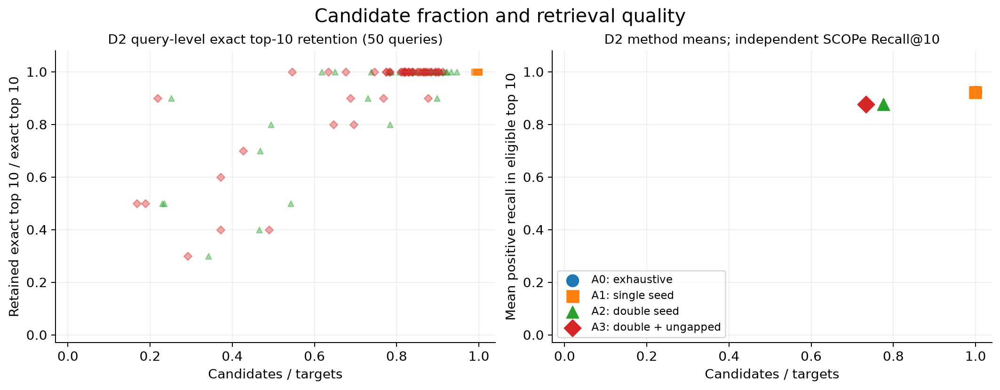
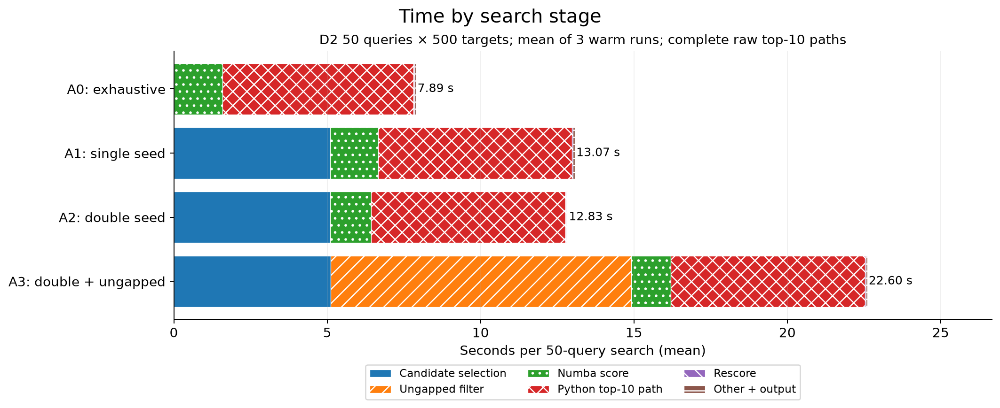
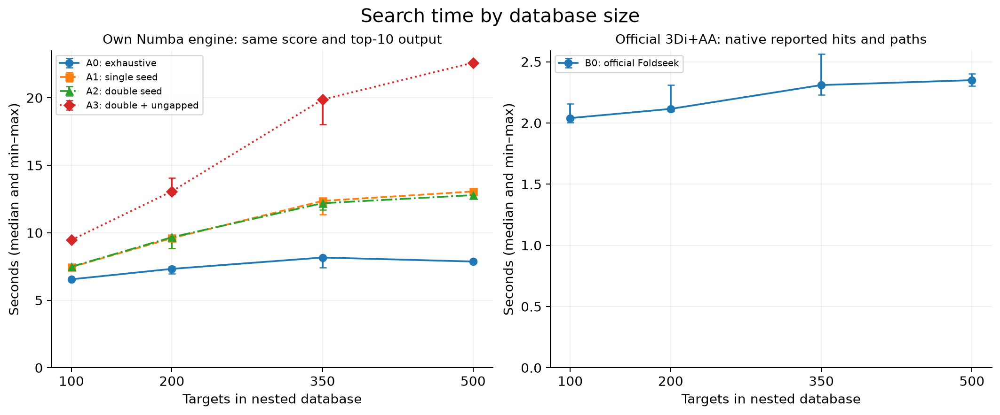

# mini-3di-search: locked structure-search evaluation

개발과 분리한 실제 구조 50×500에서 후보 필터는 계산을 줄였지만 총시간을 줄이지 못했다.
double 필터는 자체 전수 top10을 92.4% 보존했고, 전수검색 7.84초에 비해 12.78초가 걸렸다.
87회 실측과 새 가상환경의 225개 테스트를 완료했다. 작은 선택 표본에서 얻은 v0.1 결과다.

## 연구 질문과 구현 범위

이 프로젝트의 질문은 “짧은 구조 패턴으로 정밀 비교 대상을 줄이면, 좋은 검색 결과를
얼마나 보존하면서 실제 시간을 아낄 수 있는가?”다. 이를 위해 정확한 전수검색을 먼저 만들고,
동일한 점수를 사용하는 후보 필터와 비교했다. 마지막 M5에서는 개발에 쓰지 않은 구조
분류의 자료에 설정을 그대로 적용한다. 속도가 개선되지 않거나 목표 보존율에 미달하는
경우도 결과로 남긴다. 논문의 전체 실험이나 대규모 DB의 속도 배수를 재현하는 작업은 아니다.

공식 Foldseek가 제공하는 구조→3Di encoder, 학습된 3Di 점수 행렬과 공식 검색 실행 파일은
외부 자산이다. 자체 작성한 부분은 k-mer 위치 인덱스, seed 후보 선택, 같은 대각선의 두 hit,
ungapped 필터, affine-gap Smith–Waterman, Numba score 커널, 순위·경로 출력과 평가 코드다.
Biopython은 검증용으로만 사용하며 검색을 대신하지 않는다.

우리는 연속한 exact k-mer를 사용한다. 원본의 더 정교한 seed와 보정 전체를 구현하지 않았다.
자체 점수는 3Di-only이고 B0는 공식 3Di+AA 정렬이므로 같은 수치 척도가 아니다. 자체 raw
score에 E-value·상동성 확률·TM-score라는 의미를 붙이지 않는다. 공식 결과와의 겹침은
agreement이며 생물학적 정답률로 취급하지 않는다.

## 데이터와 독립 평가 기준

원자료는 Foldseek 저자가 공개한 SCOPe 2.01 기반 11,211개 domain benchmark다. 도메인은
단백질의 구조적 단위이며 전체 단백질 수와 같은 뜻이 아니다. 구조 archive와 대응 lookup의
모든 ID를 먼저 검증했다. label은 같은 릴리스의 family/superfamily/fold 정보를 사용한다.
이 분류는 공식 도구의 검색 결과에서 만들어낸 정답이 아니다.

D1 개발 검색에는 query 25개와 target 250개를 사용했다. D2에서는 최종 D1 집합에 더해
준비 중 노출된 후보와 작은 실제 smoke까지 694개 ID, 259개 fold를 제외 대상으로 삼았다.
fold 및 원본 PDB를 가로지르는 중복을 차단하고, 이미 인코딩한 개발 AA 서열과 구조 hash를
별도로 비교했다. 이는 우리의 설정 선택 누수 방지다. pretrained encoder·행렬의 학습
자료까지 배제한 표현 학습의 완전한 out-of-distribution 검증을 뜻하지 않는다.

남은 archive 3,272개에서 고정 hash·label 규칙으로 1,416개 후보를 정했다. 길이 60–400,
단일 chain, N/CA/C 좌표 완비 조건과 입력 마스킹 정책을 적용했다. 길이 조건에서 190개,
음수 CA B-factor에서 1개를 명시적으로 제외하고 1,225개를 인코딩했다. 최종 D2는
서로 다른 50개 fold의 query 50개와 target 500개이며 길이는 60–393개 잔기다.
모든 query에 비자기 positive가 있고 query/target ID·AA·PDB·구조 hash 중복은 없다.

각 query의 positive 한 개를 우선 포함하고 나머지를 고정 hash 순서로 놓아 nested target
100·200·350·500개를 검색 전에 정했다. 따라서 DB 크기를 늘릴 때 query는 동일하고,
작은 DB의 target은 큰 DB에 그대로 포함된다. positive를 보장한 표본이므로 실제 임의 DB에서의
유병률이나 검색 난도 분포를 대표하지 않는다. 분할·exclusion·길이·원본 hash는
[자료 감사](../artifacts/m5-d2-20260906-v2/split-audit.json)와 manifest에 있다.

DB별 positive 분포는 아래와 같다. 예를 들어 `1:41`은 positive가 하나인 질의가
41개라는 뜻이다. 모든 크기에서 평가 질의는 50개, label 누락과 positive 없는 질의는 0개다.

| Target 수 | 질의별 positive 개수: 질의 수 |
|---:|---|
| 100 | 1:50 |
| 200 | 1:48, 3:2 |
| 350 | 1:46, 2:2, 4:1, 5:1 |
| 500 | 1:41, 2:3, 3:4, 6:1, 10:1 |

## 방법과 지표의 의미

M4 개발 선택은 preferred=exhaustive, best filtered=double(k=3, W=64)였다. M5의 A0는
전수검색, A1은 single-hit, A2는 double-hit, A3는 double+ungapped(threshold=20)다.
모두 같은 Numba int64 커널, 같은 learned matrix, gap open=10/extend=1을 쓴다.
점수 내림차순·ID 오름차순으로 순위를 정하고 양수 상위 10개의 좌표·CIGAR를 기존 Python
엔진으로 다시 계산한다. 다른 양수 후보의 점수도 모두 저장한다. 재채점 검증 비용을 포함한다.

B0는 Foldseek 10-941cd33의 고정 adapter로 실행한다. alignment-type=2, sensitivity=9.5,
E-value threshold=10, max-seqs=1000, thread=1, traceback을 켜고 결과를 export한다.
이 threshold와 후보 상한은 실행 전에 고정했고, 자체 검색에는 숨겨진 후보 cap이나 fallback이 없다.
B0는 native 유의성 기준을 통과한 결과의 경로를 내보내므로 자체 top10 출력과 작업량이 다르다.

- 후보 비율은 정밀 채점 후보 수/target 수다. DP 비율은 실제 score 비교의 길이 곱 합을
  전수 길이 곱 합으로 나눈다. Python의 top10 경로 재계산 DP는 별도 기록한다.
- retain_exact@10은 자체 전수 양수 상위 min(10, 결과 수) 중 후보로 남은 비율이다.
  전수 결과가 없으면 NA와 그 수를 표시한다. 생물학적 관련성 지표가 아니다.
- SCOPe에서는 같은 superfamily를 positive, 다른 fold를 negative로 정의한다. 같은 fold의
  다른 superfamily는 ambiguous, label 누락은 unknown으로 집계하고 biological 순위에서 제외한다.
- Hit@10은 관련 구조를 한 개 이상 찾은 질의 비율, Recall@10은 각 질의의 positive 중
  회수한 비율의 평균, Precision@10은 발견한 positive 수/10이다. 반환 부족분을 성공으로
  취급하지 않는다. positive 없는 질의와 유효 target이 10개 미만인 경우의 NA를 따로 센다.
- official overlap@10은 자체와 B0 raw 상위 10개 ID 교집합/10이다. 생물학적 지표와 다른 열이다.

2026년 9월 6일 01:10:59 KST에 코드 commit `2149905`, 의존성·설정·행렬·구조·label을
[FREEZE](../FREEZE.md)에 기록했다. 검색 시작 시 1,707개 파일의 hash를 검사한다.
검색 결과를 보고 k/W/threshold/gap, 후보 cap이나 metric 정의를 바꾸지 않는다.
전수 25,000쌍의 DP는 667,972,214 cells로 사전 상한 10^9 이하다.

## 실측 결과

최종 50×500에서 A2는 후보를 22.42%, score DP를 14.18% 줄이고 자체 전수 top10을
평균 92.4% 보존했다. 그러나 같은 backend의 검색 시간은 A0 7.84초에서 A2 12.78초로
늘었고, 독립 분류 Recall@10도 92.27%에서 87.60%로 낮아졌다. 개발에서 선택한 A0를
유지할 근거이며, D2를 보고 새 설정을 선택하지 않았다.

아래 비율의 분모는 각 모드 동일한 50개 질의다. candidate는 500개 대상 대비 비율,
DP는 전수 667,972,214 cells 대비 비율이다. B0 내부 후보·DP는 관측하지 않았으므로 NA다.

| 방법 | 후보 % | DP % | exact 보존 % | Hit % | Recall % | Precision % | 공식 겹침 % |
|---|---:|---:|---:|---:|---:|---:|---:|
| A0 전수 | 100.00 | 100.00 | 100.0 | 94.0 | 92.27 | 13.6 | 45.6 |
| A1 single | 99.86 | 99.94 | 100.0 | 94.0 | 92.27 | 13.6 | 45.6 |
| A2 double | 77.58 | 85.82 | 92.4 | 90.0 | 87.60 | 13.0 | 44.6 |
| A3 +ungapped | 73.28 | 82.57 | 91.2 | 90.0 | 87.60 | 13.0 | 44.4 |
| B0 공식 | NA | NA | NA | 92.0 | 91.60 | 13.8 | NA |

원본은 [질의별 지표](../artifacts/m5-final-20260906/sizes/500/quality-rows.json)와
[집계](../artifacts/m5-final-20260906/sizes/500/quality-summary.json)다. 최종 DB는
실패 질의·빈 결과·positive 없는 질의·unknown label 모두 0개다. 전체 질의-대상 관계 중
ambiguous는 28쌍이며, 각 검색의 반환 목록에서 제외한 수는 A0/A1/A2/A3/B0 순으로
28/28/23/22/18이다. 이는 질의 수가 아닌 관계 수다. 100-target DB에서는 B0의 빈 결과
질의가 1개였고 그대로 분모에 포함했다. 이 크기에서 A2/A3 exact 보존은 89.2/88.2%로
목표 90%에 미달했다. 최종 DB의 평균 목표 달성은 모든 질의·크기에 대한 보장이 아니다.



그림 1. 왼쪽은 질의별 점, 오른쪽은 방법별 평균이다. 겹치는 A0/A1 점도 포함하며,
생물학적 Recall과 자체 점수 기준 보존율을 같은 지표로 합치지 않는다.

시간은 50개 질의를 모두 검색하는 초 단위 값이며 세 반복의 중앙값 [최소, 최대]다.
자체 모드는 동일한 점수·top10 상세 경로 출력 조건이다.

| 방법 | warm 검색 | warm 검색+출력 |
|---|---:|---:|
| A0 | 7.843 [7.829, 7.925] | 7.871 [7.857, 7.953] |
| A1 | 13.041 [13.009, 13.105] | 13.061 [13.025, 13.122] |
| A2 | 12.777 [12.773, 12.899] | 12.791 [12.786, 12.913] |
| A3 | 22.573 [22.510, 22.662] | 22.602 [22.529, 22.680] |

B0의 사전 변환 DB 검색 명령은 2.247 [2.202, 2.300]초, export는
0.076 [0.076, 0.076]초, wrapper 전체는 2.350 [2.302, 2.403]초였다.
점수·출력 작업량이 다르므로 이 숫자로 같은 작업의 가속 배수를 주장하지 않는다.
[자체 원본](../artifacts/m5-final-20260906/sizes/500/warm-summary.json)과
[공식 원본](../artifacts/m5-final-20260906/sizes/500/native-summary.json)에 반올림 전 값이 있다.



그림 2. 세 반복의 단계별 평균을 더한 값이다. 합산 가능한 평균을 사용하며 표의 중앙값과
구분한다. A0는 점수 계산 약 1.59초보다 top10 경로 재계산 약 6.20초가 크다.
A2는 score 시간을 약 0.26초 줄이는 대신 후보 선택에 약 5.08초를 쓴다.
A3에는 ungapped 검사 약 9.82초가 더 든다. 후보 감소를 총시간 절약으로 해석할 수 없는 이유다.

별도 [A0 프로파일](../artifacts/m5-final-20260906/profile-exhaustive/profile.txt)에서
Python `align`은 500회 호출되었고, [A3 프로파일](../artifacts/m5-final-20260906/profile-double-ungapped/profile.txt)에는
`ungapped_score` 240,044회와 그 안의 반복 인코딩·범위 검사가 나타났다.
프로파일에는 RSS 감시·thread 대기와 계측 오버헤드도 섞이므로 누적 시간을 합쳐 비율을
계산하지 않는다. 병목 판단은 이 호출 구조와 비계측 반복의 단계별 시간을 함께 근거로 삼았다.



그림 3. 동일 질의와 nested DB의 실제 100/200/350/500개 지점 및 세 반복 범위다.
연결선은 관측 순서를 보여주며 외삽 모델이 아니다. 공식 결과는 다른 실행 범위를 가진
별도 패널이다. 이 네 크기에서 자체 A0가 가장 빨랐다.

## 실행 범위와 불확실성

실제 변환·새 프로세스 비용까지 포함하면 다음과 같다. 각 셀은 초 단위 중앙값 [최소, 최대]다.
원본은 [fresh](../artifacts/m5-final-20260906/fresh-process/summary.json),
[자체 전체 실행](../artifacts/m5-final-20260906/end-to-end/summary.json),
[공식 전체 실행](../artifacts/m5-final-20260906/native-end-to-end/summary.json)에 있다.

| 방법 | fresh 프로세스 전체 | 구조 변환 포함 프로세스 전체 | 전체 실행 부모 RSS MiB 범위 |
|---|---:|---:|---:|
| A0 | 8.655 [8.623, 8.679] | 10.263 [10.222, 10.351] | 168.9–170.5 |
| A1 | 13.869 [13.841, 13.870] | 15.402 [15.254, 15.444] | 209.8–234.0 |
| A2 | 13.637 [13.578, 13.645] | 15.161 [15.122, 15.195] | 219.0–230.0 |
| A3 | 23.385 [23.023, 23.707] | 24.894 [24.757, 24.925] | 224.2–232.1 |
| B0 | 위 표의 native 검색 범위 참조 | 4.017 [3.941, 4.203] | 955.8–956.6 |

A0 전체 실행의 질의/대상 변환 중앙값은 0.290/1.232초, 첫 JIT 호출은 0.251초였다.
각 phase 중앙값의 합이 전체 중앙값과 반드시 같지는 않다. 자체 warm은 장시간 살아 있는
공유 프로세스여서 이전 실행의 할당 영향을 포함한다. 500-target A0/A1/A2/A3의 warm RSS
범위는 각각 212.5–240.7/236.9–255.9/235.5–244.2/247.4–255.5MiB였다.
B0 검색 하위 프로세스는 약 875MiB였으나 짧은 export의 RSS는 완전하게 관측하지 못했다.

CPU 계산 thread=1, 표본별 timeout 900초, process-tree RSS 상한 8GiB를 적용한다.
각 DB 크기의 A0–A3/B0 순서는 고정 seed로 섞고 세 번씩 측정한다. 최초 JIT 호출과
전수 기준 순위를 만드는 별도 실행은 측정 반복에서 제외한다. 최종 크기는 새 프로세스 및
실제 구조 변환부터 포함하는 end-to-end도 반복하여 준비 비용과 검색 비용을 구분한다.

warm은 입력·인덱스·JIT 준비 완료 후의 검색이며, fresh는 Python 시작·읽기·무결성 검사·JIT를
포함한다. end-to-end는 고정된 구조를 실제로 다시 변환하고 그 결과로 검색한다. 다운로드는
취득 비용으로 분리한다. 새 프로세스가 OS disk cache cold를 의미하지는 않는다.
공식 명령 시간에는 프로세스 실행·감시·로그 비용이 포함되며 50ms polling의 분해능 한계가 있다.
50ms 목표 간격의 RSS 표본은 순간 peak를 놓칠 수 있으며, 내부와 부모의 관측 완전성 flag를
분리한다. 내부 sampler의 incomplete는 B0 warm 12회, 자체 전체 실행 12회, B0 전체 실행
3회다. 별도 프로세스 27회의 부모 관측은 모두 complete였다. 관측된 최고 RSS는
1,115.75MiB였으나 미관측 순간까지 예산 준수를 증명하는 값은 아니다. Numba의 rolling-row
절약은 score 계산에 적용되고 top10 Python 경로는 전체 표를 쓴다.

같은 query fold를 단위로 1,000회 bootstrap해 작은 선택 표본 내부의 변동을 요약한다.
A2 exact 보존의 95% percentile 구간은 87.2–96.4%, Recall은 77.87–95.60%였다.
A0 Recall 구간은 85.2–98.0%, B0는 83.6–98.0%로 넓다. 점추정의 작은 차이를 우월성이나
모집단 보장으로 해석하지 않는다. [A2 bootstrap 원본](../artifacts/m5-final-20260906/double-bootstrap.json).
한 machine·세 반복·최대 500 targets에서 얻은 시간 차이를 모든 DB 규모에 일반화하지 않는다.
M3는 모든 후보의 상세 경로를 만들고 M4/M5는 top10만 복원하므로 두 단계의 총시간 비율을
순수 JIT 속도 향상으로 해석하지 않는다. 자체와 공식 도구의 점수·출력 범위 차이도 유지한다.

## 실패 사례와 다음 실험

준비 실패 하나는 검색 결과와 무관한 입력 정책 문제였다. `d2cbia1`의 CA B-factor
-0.67/-1.13/-1.38 위치가 공식 encoder에서 AA·3Di 소문자로 나왔다. 고정
[upstream 구현](https://github.com/steineggerlab/foldseek/blob/941cd33ff0771cd2e3f144e3293e22a2b87e9fda/src/strucclustutils/structcreatedb.cpp)은
threshold=0보다 낮은 값을 소문자로 마스킹한다. 기존 uppercase 계약을 몰래 완화하지 않고
이 구조를 사유와 함께 제외했다. 첫 실패 로그도 보존했다. 이 한계 때문에 결측·마스킹이
다양한 일반 구조 파일을 모두 지원한다고 주장하지 않는다.

검색 실패는 평균으로 가려지지 않도록 원래 질의와 후보 목록을 추적했다.
`d1ksqa_`의 유일한 positive `d1uzka3`는 A0 raw score 111의 1위였다.
A1에서는 남았지만 A2부터 후보에서 제외되어 해당 질의의 Recall은 1에서 0으로 떨어졌다.
`d1p9ka_`의 positive `d1jh3a_`도 score 105의 1위였으나 동일하게 제외되었다.
두 질의의 A2 exact 보존율은 각각 50%, 40%다. 이는 정렬 점수 오류가 아니라
정밀 정렬 전에 적용한 두 seed 조건으로 생긴 누락이다. 반면 `d1x6fa1`은 A0와 필터 모두
Recall이 0이다. 전수검색에서도 생기는 순위·점수 표현의 한계는 필터 손실과 구분한다.

다음 실험 하나는 **Python top10 경로 재계산을 같은 동점·좌표·CIGAR 계약의 CPU 커널로
최적화**하는 것이다. 먼저 점수·경로·재채점을 독립 검사하고, 같은 출력의 전수검색에서
총시간과 RSS가 얼마나 달라지는지 잰다. 이 제안은 아직 구현하지 않았다. D2는 이미 결과를
본 자료이므로 이후 개발에 사용하면 더 이상 새로운 최종 test라고 부르지 않는다.

## 기여와 재실행

사용자는 프로젝트 방향과 실행 범위를 지정하고, 설명을 요청하며 데이터 용량 예외를 승인했다.
Codex는 AI 보조로 코드·테스트·실험 실행·로그 검토·보고서 작성을 수행했다. 이 대화에서
사용자가 직접 코드를 검증하거나 별도로 결과를 재현했다는 사실은 확인되지 않았다.
사용자 본인의 구현·독립 해석으로 포장하지 않는다. 공개 배포와 GitHub push는 수행하지 않는다.

환경은 CPython 3.12.14, NumPy 2.5.2, Numba 0.67.0, llvmlite 0.49.0, macOS arm64다.
그림은 Matplotlib 3.11.1의 기본 색상을 사용한다. 기본 lock은 유지하고 그림 의존성은
`requirements-report.lock.txt`에 따로 고정했다. 새 별도 가상환경의 설치·offline demo·전체
test·실제 CLI·Ruff까지 12개 명령 모두 exit 0, **225 passed / 0 failed / 0 skipped**였다.
새 환경은 `artifacts/m5-validation-20260906/venv`에 만들었고, 해시를 확인한 로컬 wheel만으로
설치했다. 패키지는 non-editable 설치이며 site-packages 경로를 확인했다.
전체 D2 25,000쌍을 독립 Biopython 점수와 대조하고, 설치된 CLI의 점수도 저장된 전수 기준과
일치함을 확인했다. 이 테스트는 계산 계약의 검증이지 생물학적 유용성을 증명하는 검사가 아니다.
[실행 로그](../artifacts/m5-validation-20260906/validation.json),
[요구사항 감사](M5_AUDIT.md)에 경계와 증거를 연결했다.

프로젝트 루트의 고정 환경에서 실제 수행한 핵심 명령은 다음과 같다. 이미 있는 산출물을
덮어쓰지 않는다. 검증을 재실행할 때만 마지막 `--out`을 새 경로로 바꾼다.

```bash
.venv/bin/python scripts/m5_study.py run \
  --contract artifacts/m5-final-20260906/freeze-contract.json
.venv/bin/python scripts/m5_figures.py \
  --study artifacts/m5-final-20260906 --out docs/figures/m5
.venv/bin/python scripts/verify_m5.py \
  --study artifacts/m5-final-20260906 \
  --wheelhouse artifacts/m5-preflight-20260905T155705Z/wheels \
  --out artifacts/m5-validation-20260906
```

전체 benchmark를 새로 실행하려면 별도 checkout에서 [M5 계획](M5_PLAN.md)의 prepare→seal→run
순서를 따라 새 계약과 출력 경로를 만든다. 기존 D2와 결과를 본 뒤의 재실행은 새로운 독립
평가가 아니다. 큰 구조·바이너리·raw logs는 로컬 `artifacts/`에 있고 Git에는 코드·고정 설정·
문서·그림과 hash가 남는다. 다른 운영체제의 설치와 원자료 재다운로드까지 새로 검증한 것은 아니다.
